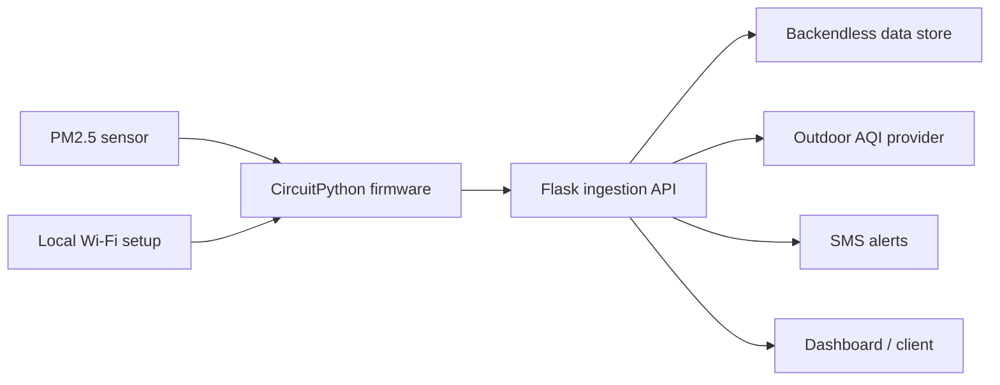

# myAQI IoT Platform

[](https://github.com/rdfds/myaqi-iot-platform/actions/workflows/ci.yml)

An end-to-end indoor air-quality monitoring platform for school deployments. CircuitPython firmware reads particulate-matter sensors, provisions Wi-Fi locally, reports device health, and sends measurements to a Flask backend. The backend combines indoor and outdoor readings and can notify configured contacts when conditions cross alert thresholds.

## Why this project matters

This is a physical-systems project: the interesting work is not only reading a sensor, but recovering from unreliable connectivity, making device state observable, provisioning devices without a developer laptop, and keeping alerts useful when data is incomplete.

The system was used in a 14-school deployment and includes firmware, a backend, and the operational paths around them.

## Architecture



The device lifecycle is documented in [`docs/state-machine.md`](docs/state-machine.md), and the end-to-end data flow is documented in [`docs/architecture.md`](docs/architecture.md).

## What is demonstrated

- PM2.5 sensor integration over I2C or UART
- Device state handling, status LEDs, reset behavior, and persisted errors
- On-device access-point mode and a local setup page for Wi-Fi provisioning
- Device registration and measurement upload
- Connectivity recovery, buffering, retries, and failure visibility
- Indoor/outdoor aggregation and threshold-based alerting
- Environment-only configuration with no credentials in source control

## Repository layout

- `AdafruitCode/` — CircuitPython firmware, setup page, and device state notes
- `WebServer/` — Flask routes for ingestion, registration, aggregation, and alerts
- `docs/` — architecture and state-machine documentation
- `.github/workflows/` — lightweight syntax checks for the backend

## Quick start

### Firmware

1. Install the CircuitPython libraries imported by `AdafruitCode/code.py` on the target board.
2. Copy `AdafruitCode/config.example.json` to `AdafruitCode/config.json`.
3. Set device-local Wi-Fi and service configuration.
4. Copy the contents of `AdafruitCode/` to the board.

`config.json` is ignored because it can contain local Wi-Fi and service credentials.

### Backend

```bash
cd WebServer
python -m venv .venv
source .venv/bin/activate
pip install -r requirements.txt
cd ..
cp .env.example .env
flask --app WebServer.index run
```

Fill in `.env` locally. Never commit real provider keys, phone numbers, or service-account files.

## Reliability notes

The firmware treats connectivity as a recoverable state rather than a fatal error. It exposes device status, retries uploads, and preserves enough local state to make failures diagnosable. The backend keeps provider configuration outside the repository and separates ingestion, aggregation, and alerting paths.

## Validation

Run the same syntax check used by CI:

```bash
python -m py_compile WebServer/index.py
```

The public repository contains sanitized configuration examples only. Hardware-specific behavior still requires a supported board, sensor, and local credentials. The backend endpoints are a prototype integration surface and require authentication, rate limiting, input validation, and deployment-specific controls before production use.
