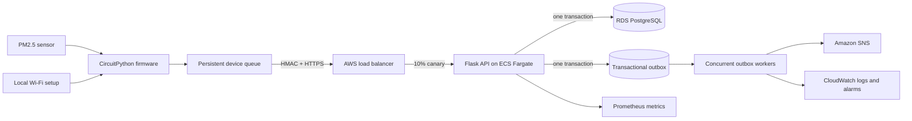

# myAQI IoT Platform

[](https://github.com/rdfds/myaqi-iot-platform/actions/workflows/ci.yml)
[](https://github.com/rdfds/myaqi-iot-platform/actions/workflows/reliability-trial.yml)

myAQI is an end-to-end indoor air-quality system spanning CircuitPython sensor firmware, local Wi-Fi provisioning, authenticated ingestion, durable measurement storage, asynchronous event delivery, and operational telemetry. Its device and provisioning foundation supported a 14-school rollout; the maintained code path carries each PM2.5 reading from the sensor to PostgreSQL through a retry-safe protocol.

## Architecture



A reading follows one continuous path:

1. The firmware reads the PM2.5 sensor, assigns a monotonic sequence number, and writes the reading to a recoverable local queue.
2. The device batches queued readings, reuses a stable idempotency key, and signs the timestamp, method, path, and exact JSON body with HMAC-SHA256.
3. The API authenticates the device and commits the request record, unseen measurements, response, and outbox event atomically.
4. A worker claims outbox events, publishes them through a downstream adapter, and applies retry, stale-lock recovery, and dead-letter handling.
5. Only a complete `202` acknowledgement allows the firmware to remove readings from local storage.

The complete boundary and failure analysis is in [`docs/architecture.md`](docs/architecture.md). Device setup and LED states are documented in [`docs/state-machine.md`](docs/state-machine.md).

## Reliability contract

The system enforces these invariants:

1. Every upload is authenticated with a per-device secret and a bounded timestamp window.
2. Reusing an idempotency key with the same body returns the committed response; reusing it with a different body returns `409`.
3. `(device_id, sequence)` is unique, so a retry under a new request key still cannot duplicate a measurement.
4. Measurements and their `measurements.ingested` event commit in the same database transaction.
5. A lost HTTP response leaves the device queue intact; the next boot safely replays the same batch.
6. Workers use exclusive claims, retry with backoff, recover abandoned work, and retain exhausted events for operator review.
7. Every successful request updates the device heartbeat, firmware release, and highest reported sequence for fleet diagnosis.

Database constraints and integration tests enforce these rules under failure and concurrency.

## Run locally

Prerequisites: Docker Compose and a local `.env` based on `.env.example`.

```bash
cp .env.example .env
# Replace POSTGRES_PASSWORD and DEVICE_MASTER_KEY before continuing.
docker compose up --build -d
```

Provision a device and copy the one-time secret into its `config.json`:

```bash
docker compose run --rm api \
  myaqi-admin provision-device school-001 --name "Science room 201"
```

The relevant device configuration is:

```json
{
  "serial_number": "school-001",
  "api_base_url": "https://api.example.org",
  "device_secret": "<secret printed by provision-device>",
  "upload_batch_size": 20,
  "max_buffered_readings": 120,
  "measurement_interval_seconds": 600
}
```

The deployed API URL must use HTTPS. Localhost HTTP is accepted only by the host-side test client. Firmware installation details are in [`AdafruitCode/README.md`](AdafruitCode/README.md), while migrations and backend commands are in [`backend/README.md`](backend/README.md).

Operational endpoints:

- `GET /health/live` — process, environment, version, and Git revision
- `GET /health/ready` — database readiness and active Git revision
- `GET /metrics` — Prometheus exposition format

## AWS operations path

[`infra/terraform/`](infra/terraform/) defines the production-shaped AWS boundary: private Fargate API and worker tasks, encrypted RDS PostgreSQL with an AWS-managed password, immutable ECR images, ACM TLS, two target groups for native 10% canaries, SNS event delivery, CloudWatch dashboards and rollback alarms, and a global Route 53 availability check.

The deployment workflow runs only after `main` CI succeeds and a protected GitHub environment approves the exact tested SHA. It uses OIDC rather than stored AWS access keys, gates critical image findings, runs migrations before service updates, verifies the public health revision, and restores prior task definitions on failure.

Infrastructure code is not deployment evidence. The AWS root has been statically validated, but this repository does not claim that an account currently hosts it. Preserve a successful deployment summary, alarm history, and a completed [`soak/`](soak/) report before making cloud, uptime, or seven-day hardware claims.

## Ingestion protocol

The firmware sends `POST /v1/devices/{device_id}/measurements:batch` with a compact body:

```json
{
  "readings": [
    {
      "sequence": 1842,
      "observed_at": "2026-08-23T14:30:00Z",
      "pm25_ug_m3": 12.7
    }
  ]
}
```

Required headers are a stable `Idempotency-Key`, the current Unix time in `X-Device-Timestamp`, and `X-Device-Signature: v1=<hex HMAC-SHA256>`. The canonical signed value is:

```text
<timestamp>\n<HTTP method>\n<request path>\n<SHA-256 of exact request body>
```

The implementation is shared as an executable contract between [`AdafruitCode/myaqi_client.py`](AdafruitCode/myaqi_client.py), [`backend/src/myaqi_backend/auth.py`](backend/src/myaqi_backend/auth.py), and the cross-boundary tests in [`firmware_tests/`](firmware_tests/).

## Verification

CI starts PostgreSQL 16, applies every Alembic migration, and runs:

```bash
pip install -e "backend[dev]"
ruff check backend firmware_tests scripts soak AdafruitCode/myaqi_client.py \
  --config backend/pyproject.toml
cd backend && alembic upgrade head && pytest --cov=myaqi_backend
cd .. && pytest firmware_tests scripts/tests soak/tests
```

The suite covers signature tampering, stale timestamps, payload bounds, idempotency conflicts, sequence deduplication, atomic outbox creation, concurrent replay, worker ownership and recovery, device runtime diagnostics, SNS event envelopes, health and queue metrics, persistent firmware state, deployment task rendering, soak evidence verification, and a lost-response replay through the real Flask ingestion route.

The manually triggered **Reliability Trial** adds an integration-level software test: it ingests
sequential signed readings through the real processes and PostgreSQL while interrupting the API
and worker and replaying acknowledgements. Each run publishes a revision-linked result and logs.
The [latest preserved result](docs/reliability/2026-08-24-software-trial.md) covered 50,000 readings
with zero missing or duplicate rows. See [`soak/README.md`](soak/README.md) for the exact scope and
the separate hardware procedure.

## Benchmark harness

The load generator reports throughput and p50/p95/p99 latency for a specified environment; it does not embed a universal performance claim.

```bash
cd backend
myaqi-admin seed-benchmark-devices --count 250 --output benchmark-devices.json
python scripts/benchmark_ingest.py \
  --base-url http://localhost:8000 \
  --devices benchmark-devices.json \
  --requests 10000 \
  --concurrency 50
```

Record hardware, worker count, database configuration, commit SHA, and raw output before quoting a result. The generated credential file is ignored.

## Repository layout

```text
AdafruitCode/          CircuitPython firmware, provisioning UI, upload client
backend/
  migrations/          Alembic schema history
  scripts/             Reproducible load generator
  src/myaqi_backend/   API, authentication, persistence, metrics, worker
  tests/               Unit, integration, and PostgreSQL concurrency tests
firmware_tests/        Host-side protocol, persistence, and end-to-end tests
docs/                  Architecture, security, operations, and decisions
infra/terraform/       AWS network, RDS, ECS, TLS, canaries, alarms, and OIDC
legacy/                Retired provider-specific adapter retained for traceability
scripts/deploy/         Auditable ECS task-revision rendering
soak/                   Automated software and supervised hardware reliability evidence
compose.yaml           PostgreSQL, migration, API, and worker services
```

## Scope

Secrets belong in environment variables, device-local configuration, or a deployment secret manager. Device benchmark credentials, local databases, upload state, and `.env` files are ignored.

The provider-specific adapter under `legacy/` is not part of the runtime. The automated software
trial exercises real local processes and PostgreSQL, not a sensor board or AWS account.
Target-board networking, flash durability, the physical sensor path, the AWS apply, DNS
validation, and the full supervised soak still require execution in their real environments. The
Terraform and workflow implement TLS termination, managed database credentials, backups, staged
rollouts, external health checks, dashboards, alarms, and SNS publishing; they do not create
historical uptime or incident evidence by existing in Git. See [`docs/security.md`](docs/security.md)
and [`docs/runbook.md`](docs/runbook.md).
