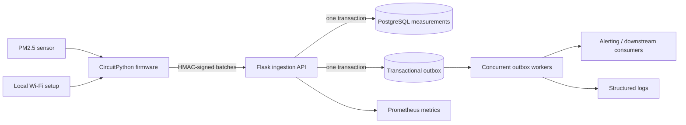

# myAQI IoT Platform

[](https://github.com/rdfds/myaqi-iot-platform/actions/workflows/ci.yml)

An end-to-end indoor air-quality system spanning CircuitPython firmware, local Wi-Fi provisioning, authenticated ingestion, durable measurement storage, asynchronous event delivery, and operational telemetry.

> **Public showcase:** This sanitized snapshot was published in August 2026 from a system developed and deployed during 2021–2024. Public commit dates reflect showcase preparation; deployment credentials and private configuration remain excluded.

The original system was used in a 14-school deployment. This repository preserves that 2021-2024 firmware and Flask prototype while developing a separate 2026 reference backend around the failure modes that matter in an IoT service: intermittent connectivity, retried uploads, duplicated readings, worker crashes, and unavailable downstream providers.

## System generations

| Path | Purpose | Status |
| --- | --- | --- |
| `AdafruitCode/` | Original CircuitPython firmware, device state handling, and local setup page | Historical deployment code, sanitized for publication |
| `WebServer/` | Original Backendless/Twilio integration | Historical prototype; retained for traceability |
| `backend/` | PostgreSQL reference backend with signed batch ingestion and a transactional outbox | Actively tested 2026 reference implementation |

The reference backend is not presented as the backend that powered the historical deployment. Keeping those generations explicit makes the repository useful without rewriting the project's history.

## Reference architecture



The complete boundary and failure analysis is in [`docs/architecture.md`](docs/architecture.md). The device lifecycle remains documented in [`docs/state-machine.md`](docs/state-machine.md).

## Reliability contract

The reference backend is designed around six invariants:

1. Every device request is signed over its timestamp, method, path, and exact body.
2. A timestamp window limits replay, and secrets are derived per device from a versioned master key.
3. Reusing an idempotency key with the same body returns the original response; reusing it with a different body returns `409`.
4. `(device_id, sequence)` is unique, so firmware retries cannot create duplicate measurements even when a new request key is used.
5. Measurements and their `measurements.ingested` outbox event commit in the same database transaction.
6. Workers claim events with `FOR UPDATE SKIP LOCKED`, recover stale locks, retry with backoff, and move exhausted events to a dead-letter state.

These are enforced by database constraints and tests, not only by application-level checks.

## API example

`POST /v1/devices/{device_id}/measurements:batch`

```json
{
  "readings": [
    {
      "sequence": 1842,
      "observed_at": "2026-08-23T14:30:00Z",
      "pm25_ug_m3": 12.7,
      "temperature_c": 22.4,
      "relative_humidity": 44.1
    }
  ]
}
```

Required headers:

- `Idempotency-Key`: stable across retries of the same batch
- `X-Device-Timestamp`: current Unix timestamp
- `X-Device-Signature`: `v1=<hex HMAC-SHA256>`

The canonical signed value is:

```text
<timestamp>\n<HTTP method>\n<request path>\n<SHA-256 of exact request body>
```

See [`backend/src/myaqi_backend/auth.py`](backend/src/myaqi_backend/auth.py) for the protocol implementation and [`backend/tests/test_auth.py`](backend/tests/test_auth.py) for executable examples.

## Run locally

Prerequisites: Docker Compose and a local `.env` based on `.env.example`.

```bash
cp .env.example .env
# Replace POSTGRES_PASSWORD and DEVICE_MASTER_KEY before continuing.
docker compose up --build -d
```

Provision a device and print its derived secret once:

```bash
docker compose run --rm api myaqi-admin provision-device school-001 --name "Science room 201"
```

Operational endpoints:

- `GET /health/live` - process liveness
- `GET /health/ready` - database readiness
- `GET /metrics` - Prometheus exposition format

The backend-specific setup, migration, test, and benchmark commands are in [`backend/README.md`](backend/README.md).

## Verification

CI uses PostgreSQL 16 and runs:

```bash
pip install -e "backend[dev]"
ruff check backend
cd backend
alembic upgrade head
pytest --cov=myaqi_backend
```

The suite covers:

- signature tampering and stale timestamps
- payload bounds and duplicate sequences within a batch
- idempotent replay and conflicting payloads
- sequence-level deduplication across request keys
- atomic measurement/outbox persistence
- exclusive worker claims, ownership checks, retry backoff, and dead-letter transitions
- concurrent identical requests against PostgreSQL
- liveness, readiness, request IDs, and Prometheus counters

## Benchmark harness

The repository includes a load generator that reports observed throughput and p50/p95/p99 latency for a specific environment. It intentionally commits no universal performance claim.

```bash
cd backend
myaqi-admin seed-benchmark-devices --count 250 --output benchmark-devices.json
python scripts/benchmark_ingest.py \
  --base-url http://localhost:8000 \
  --devices benchmark-devices.json \
  --requests 10000 \
  --concurrency 50
```

Record hardware, worker count, database configuration, commit SHA, and raw output before quoting any result. The benchmark file is ignored because it contains device credentials.

## Repository layout

```text
AdafruitCode/          Historical firmware and provisioning UI
WebServer/             Historical Flask/provider prototype
backend/
  migrations/          Alembic schema history
  scripts/             Reproducible load generator
  src/myaqi_backend/   API, authentication, persistence, metrics, worker
  tests/               Unit, integration, and PostgreSQL concurrency tests
docs/                  Architecture, security, operations, and decisions
compose.yaml           PostgreSQL, migration, API, and worker services
```

## Security and scope

Secrets and provider credentials belong in environment variables or a deployment secret manager. Device benchmark credentials, local databases, and `.env` files are ignored.

This is a reference implementation, not a claim of current production operation. Before a real deployment, add managed secret rotation, TLS termination, network policy, backups, an external alert publisher, dashboarding, and deployment-specific rate limits. The concrete threat model is in [`docs/security.md`](docs/security.md).
