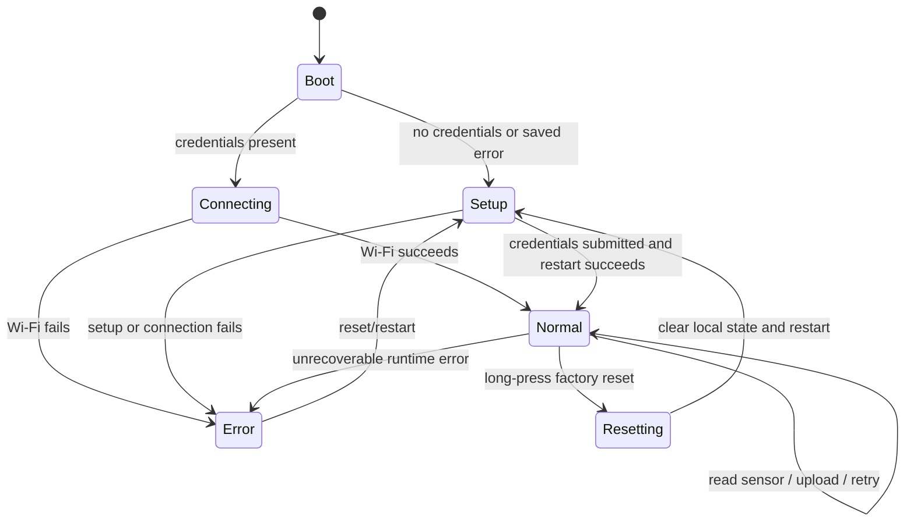

# Device state machine

```mermaid
stateDiagram-v2
    [*] --> Boot
    Boot --> Setup: no credentials or saved error
    Boot --> Connecting: credentials present
    Connecting --> Normal: Wi-Fi succeeds
    Connecting --> Error: Wi-Fi fails
    Error --> Setup: reset/restart
    Setup --> Normal: credentials submitted and restart succeeds
    Setup --> Error: setup or connection fails
    Normal --> Normal: read sensor / upload / retry
    Normal --> Error: unrecoverable runtime error
    Normal --> Resetting: long-press factory reset
    Resetting --> Setup: clear local state and restart
```

The LED communicates the active state locally. A long press clears local credentials and error state, then restarts the device into setup mode.
