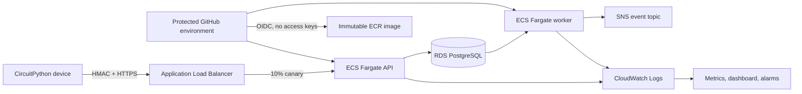

# AWS deployment

This Terraform root prepares a real AWS operating environment for myAQI. It creates an encrypted RDS PostgreSQL instance with an RDS-managed password, private Fargate tasks, an immutable ECR repository, an ACM-backed HTTPS load balancer, native ECS canary deployments, CloudWatch dashboards and alarms, SNS delivery, and a tightly scoped GitHub OIDC deployment role.

Each environment should retain its Terraform outputs, GitHub deployment summary, CloudWatch alarm history, and associated hardware-soak report as the operational release record.

## Runtime boundary



Application and database subnets are private. One NAT gateway provides controlled outbound access for image pulls, SNS, and logs; the database subnets have no internet route. The public load balancer is the only API ingress, and it forwards only to the API security group. This design incurs ongoing AWS charges for the NAT gateway, load balancer, RDS, Fargate tasks, logs, and related services even at low traffic.

## Prerequisites

- An AWS account and a Route 53 public hosted zone for `domain_name`
- An S3 state bucket with versioning, encryption, public-access blocking, and permissions for the infrastructure operator
- A Secrets Manager secret containing at least 32 random characters for `DEVICE_MASTER_KEY`
- Terraform 1.8 or later
- A protected GitHub environment whose name exactly matches `github_environment`

The state bucket and device master secret are intentionally outside this Terraform state. Create them through an audited bootstrap process; never pass the secret value as a Terraform variable.

## First deployment

Copy the examples, replace every sample identifier, and keep the real files untracked:

```bash
cp backend.hcl.example backend.hcl
cp terraform.tfvars.example terraform.tfvars
terraform init -backend-config=backend.hcl
terraform plan -out=staging.tfplan
terraform apply staging.tfplan
```

For the first apply, leave `api_desired_count` and `worker_desired_count` at zero. ECS can register the bootstrap task definitions without attempting to pull the placeholder image.

Create the `aws-staging` GitHub environment, require a reviewer, restrict it to the protected `main` branch, and set these environment variables from Terraform outputs:

| GitHub variable | Source |
|---|---|
| `AWS_REGION` | Terraform `aws_region` input |
| `AWS_ACCOUNT_ID` | AWS account ID |
| `AWS_DEPLOY_ROLE_ARN` | `github_deploy_role_arn` |
| `DEPLOYMENT_NAME` | `deployment_name` |
| `ECR_REPOSITORY` | `ecr_repository_name` |
| `API_URL` | `api_url` |
| `API_DESIRED_COUNT` | normally `2` |
| `WORKER_DESIRED_COUNT` | normally `1` |

Confirm the SNS email subscription, then manually run **Deploy AWS** once. The workflow builds and scans the exact Git revision, pushes an immutable ARM64 image with SBOM and provenance, registers task revisions, applies Alembic migrations, deploys the worker, sends 10% of API traffic to the canary for five minutes, completes a five-minute post-shift bake, and checks the public health revision and alarm state. ECS rolls the canary back if health or application alarms fire; the workflow also restores the previous API and worker task definitions after a later failure.

After the first successful release, set `api_desired_count = 2` and `worker_desired_count = 1` in `terraform.tfvars` and apply again so infrastructure state reflects normal capacity.

## Routine changes

Pull requests run PostgreSQL migrations and the complete test suite in CI. A successful `main` CI run starts the deployment workflow at that tested SHA and waits at the protected environment gate. Image tags are commit SHAs and ECR rejects tag mutation.

Schema changes must remain backward compatible with the currently running API during the canary and bake windows. A destructive migration requires an explicit expand/migrate/contract sequence across separate releases.

Run `terraform plan` for infrastructure changes and review replacements, IAM changes, public ingress, deletion protection, and monthly cost impact before applying. Do not run a broad destroy against a production state; the database is deletion-protected and always creates a final snapshot.

## Validation performed in the repository

The checked-in configuration is formatted and validated with Terraform 1.15.9 and AWS provider 6.61.0. GitHub workflow YAML and embedded shell blocks are checked with actionlint and `bash -n`. Provider validation does not call AWS APIs, create resources, confirm DNS ownership, or establish that an account has sufficient quotas.
